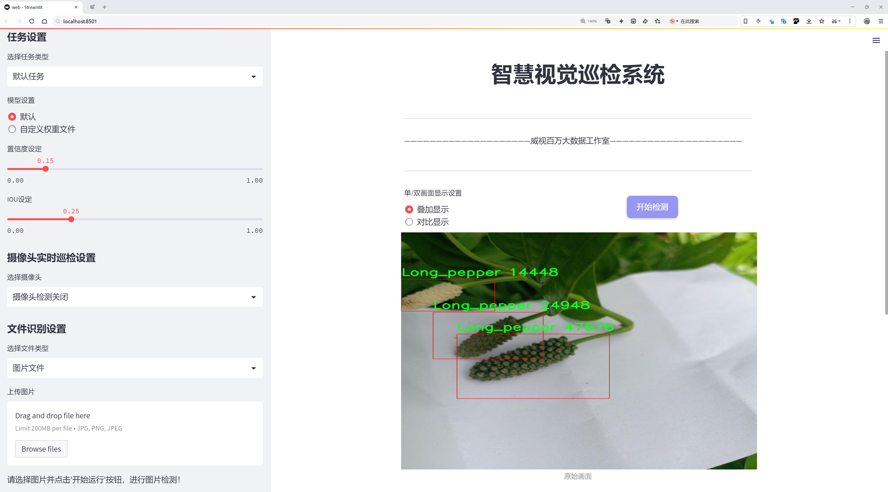
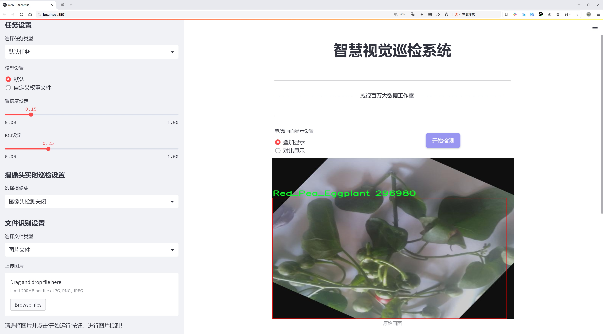
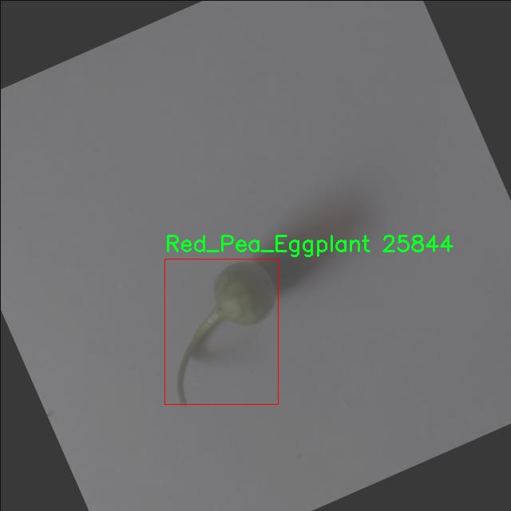
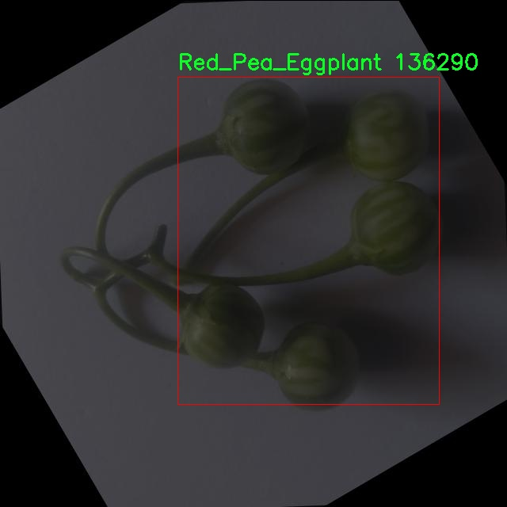
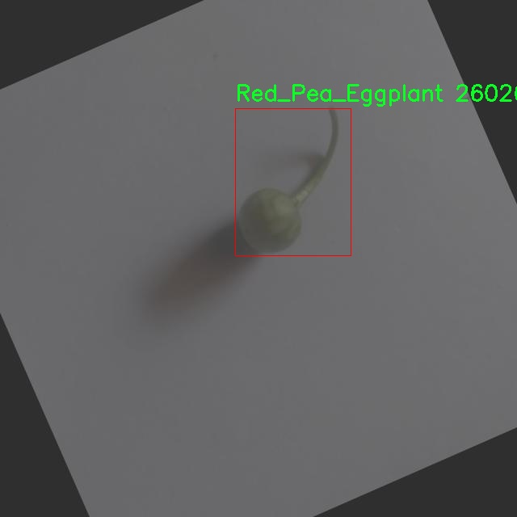

# 水果种类检测检测系统源码分享
 # [一条龙教学YOLOV8标注好的数据集一键训练_70+全套改进创新点发刊_Web前端展示]

### 1.研究背景与意义

项目参考[AAAI Association for the Advancement of Artificial Intelligence](https://gitee.com/qunmasj/projects)

项目来源[AACV Association for the Advancement of Computer Vision](https://kdocs.cn/l/cszuIiCKVNis)

研究背景与意义

随着全球人口的不断增长和城市化进程的加快，食品安全和农业生产的可持续性问题日益凸显。水果作为人类日常饮食中不可或缺的部分，其种类繁多、营养丰富，具有重要的经济和社会价值。然而，传统的水果种类识别方法往往依赖于人工观察和经验判断，效率低下且容易受到主观因素的影响。近年来，计算机视觉技术的迅猛发展为水果种类的自动识别提供了新的解决方案，尤其是基于深度学习的目标检测算法在图像识别领域展现出了优异的性能。

YOLO（You Only Look Once）系列算法作为目标检测领域的代表性方法，以其高效的实时检测能力和较高的准确率受到广泛关注。YOLOv8作为该系列的最新版本，进一步提升了模型的检测精度和速度，适用于各种复杂场景下的目标识别任务。针对水果种类的检测，YOLOv8能够快速处理大量图像数据，并准确识别出不同种类的水果，为农业生产、市场销售及食品安全监测提供了强有力的技术支持。

本研究基于改进的YOLOv8模型，构建了一套水果种类检测系统，旨在实现对多种水果的快速、准确识别。我们所使用的数据集“ayushvision_fruits”包含1600张图像，涵盖了9种不同的水果类别，包括印度麻、藤瓜、青柠、长椒、佩达利乌姆、红豌豆茄子、环虫植物、刺苹果和蓖麻。这些水果在不同的生长环境和市场中具有广泛的应用价值，然而由于其外观相似性和生长环境的多样性，传统的识别方法往往难以实现高效准确的分类。因此，基于YOLOv8的水果种类检测系统的研究不仅具有重要的理论意义，也具有广泛的实际应用前景。

通过对数据集的深入分析和模型的优化调整，本研究将探索如何在保证检测精度的前提下，提高模型的实时性和适应性。我们将采用数据增强、迁移学习等技术手段，提升模型在不同环境下的泛化能力，以应对水果种类多样性和图像质量差异带来的挑战。此外，研究还将结合实际应用场景，探讨该检测系统在智能农业、物流管理及食品安全等领域的应用潜力。

综上所述，基于改进YOLOv8的水果种类检测系统的研究，不仅为水果识别提供了一种高效的技术手段，也为推动农业智能化、提升食品安全管理水平提供了新的思路和方法。随着技术的不断进步和应用的深入，期待该系统能够在未来的农业生产和市场流通中发挥重要作用，助力实现可持续发展目标。

### 2.图片演示






##### 注意：由于此博客编辑较早，上面“2.图片演示”和“3.视频演示”展示的系统图片或者视频可能为老版本，新版本在老版本的基础上升级如下：（实际效果以升级的新版本为准）

  （1）适配了YOLOV8的“目标检测”模型和“实例分割”模型，通过加载相应的权重（.pt）文件即可自适应加载模型。

  （2）支持“图片识别”、“视频识别”、“摄像头实时识别”三种识别模式。

  （3）支持“图片识别”、“视频识别”、“摄像头实时识别”三种识别结果保存导出，解决手动导出（容易卡顿出现爆内存）存在的问题，识别完自动保存结果并导出到tempDir中。

  （4）支持Web前端系统中的标题、背景图等自定义修改，后面提供修改教程。

  另外本项目提供训练的数据集和训练教程,暂不提供权重文件（best.pt）,需要您按照教程进行训练后实现图片演示和Web前端界面演示的效果。

### 3.视频演示

[3.1 视频演示](https://www.bilibili.com/video/BV1tBxFeME9K/)

### 4.数据集信息展示

##### 4.1 本项目数据集详细数据（类别数＆类别名）

nc: 8
names: ['Indian_mallow', 'Ivy_gourd', 'Lime', 'Long_pepper', 'Pedaliummurex', 'Red_Pea_Eggplant', 'Ring_worm_plant', 'ThornApple']


##### 4.2 本项目数据集信息介绍

数据集信息展示

在现代计算机视觉领域，数据集的质量和多样性直接影响着模型的训练效果和应用性能。为了改进YOLOv8的水果种类检测系统，我们选用了名为“ayushvision_fruits”的数据集，该数据集专注于特定的植物种类，涵盖了八个独特的类别。这些类别包括印度木槿（Indian mallow）、藤瓜（Ivy gourd）、青柠（Lime）、长椒（Long pepper）、Pedaliummurex、红豌豆茄（Red Pea Eggplant）、环虫草（Ring worm plant）和刺苹果（Thorn Apple）。每一个类别都代表了特定的植物特征和生长环境，能够为模型提供丰富的视觉信息。

“ayushvision_fruits”数据集的设计旨在为深度学习模型提供高质量的训练样本，以便更好地识别和分类不同种类的水果和植物。数据集中包含的八个类别不仅在外观上各具特色，而且在生物学特性和生态环境上也存在显著差异。这种多样性使得模型在训练过程中能够学习到更加细致的特征，从而提高其在实际应用中的识别准确率。例如，印度木槿以其独特的花形和叶片结构而闻名，而藤瓜则因其特殊的果实形态而易于辨识。青柠和长椒则在颜色和形状上有明显的差异，这为模型提供了丰富的视觉线索。

在数据集的构建过程中，研究团队注重数据的标注精度和样本的多样性。每个类别的样本都经过精心挑选和标注，确保其在不同生长阶段、不同光照条件下的表现都能被充分记录。这种细致的标注方式不仅提升了数据集的实用性，也为后续的模型训练提供了坚实的基础。通过对不同类别的植物进行充分的样本收集，数据集能够涵盖各种可能的变异情况，从而增强模型的泛化能力。

此外，数据集的使用也为研究人员提供了一个良好的平台，以便在YOLOv8的基础上进行进一步的改进和优化。YOLOv8作为一种先进的目标检测算法，能够在实时应用中提供高效的检测性能，而“ayushvision_fruits”数据集则为其提供了丰富的训练数据，使得模型能够在水果种类检测任务中表现出色。通过不断地迭代和优化，研究人员可以利用该数据集进行实验，探索不同的网络架构和训练策略，从而推动水果种类检测技术的发展。

总之，“ayushvision_fruits”数据集不仅为改进YOLOv8的水果种类检测系统提供了丰富的训练数据，还为相关研究提供了重要的实验基础。通过对数据集的深入分析和应用，研究人员能够不断提升模型的性能，为实际应用中的水果识别和分类任务提供更加可靠的解决方案。随着技术的不断进步和数据集的不断丰富，未来的水果种类检测系统将会更加智能化和高效化，为农业、食品安全和生态保护等领域带来深远的影响。









### 5.全套项目环境部署视频教程（零基础手把手教学）

[5.1 环境部署教程链接（零基础手把手教学）](https://www.ixigua.com/7404473917358506534?logTag=c807d0cbc21c0ef59de5)


[5.2 安装Python虚拟环境创建和依赖库安装视频教程链接（零基础手把手教学）](https://www.ixigua.com/7404474678003106304?logTag=1f1041108cd1f708b01a)

### 6.手把手YOLOV8训练视频教程（零基础小白有手就能学会）

[6.1 手把手YOLOV8训练视频教程（零基础小白有手就能学会）](https://www.ixigua.com/7404477157818401292?logTag=d31a2dfd1983c9668658)

### 7.70+种全套YOLOV8创新点代码加载调参视频教程（一键加载写好的改进模型的配置文件）

[7.1 70+种全套YOLOV8创新点代码加载调参视频教程（一键加载写好的改进模型的配置文件）](https://www.ixigua.com/7404478314661806627?logTag=29066f8288e3f4eea3a4)

### 8.70+种全套YOLOV8创新点原理讲解（非科班也可以轻松写刊发刊，V10版本正在科研待更新）

由于篇幅限制，每个创新点的具体原理讲解就不一一展开，具体见下列网址中的创新点对应子项目的技术原理博客网址【Blog】：


[8.1 70+种全套YOLOV8创新点原理讲解链接](https://gitee.com/qunmasj/good)

### 9.系统功能展示（检测对象为举例，实际内容以本项目数据集为准）

图9.1.系统支持检测结果表格显示

  图9.2.系统支持置信度和IOU阈值手动调节

  图9.3.系统支持自定义加载权重文件best.pt(需要你通过步骤5中训练获得)

  图9.4.系统支持摄像头实时识别

  图9.5.系统支持图片识别

  图9.6.系统支持视频识别

  图9.7.系统支持识别结果文件自动保存

  图9.8.系统支持Excel导出检测结果数据


### 10.原始YOLOV8算法原理

原始YOLOv8算法原理

YOLOv8是由Ultralytics团队在YOLOv5的基础上发展而来的最新目标检测模型，于2023年1月正式提出。该模型在吸收了YOLO系列的优点和经过实践验证的改进技术的基础上，致力于提升目标检测的准确性和速度。YOLOv8不仅延续了YOLO系列的高效性和实时性，还在网络结构和损失函数等多个方面进行了创新和优化。

YOLOv8的网络结构主要由输入层、主干网络、颈部网络和头部网络组成。输入层负责将输入图像调整为模型所需的固定尺寸，通常为640x640像素。接下来，主干网络通过卷积操作对图像进行特征提取。YOLOv8在主干网络中采用了C2f模块，这一模块是对YOLOv5中C3模块的改进，借鉴了YOLOv7中的ELAN结构，增加了更多的跳层连接。这种设计不仅提高了模型的梯度流动性，还在一定程度上实现了模型的轻量化，确保了在保持高检测精度的同时，计算资源的消耗得以降低。

在特征提取的过程中，YOLOv8依然保留了SPPF（Spatial Pyramid Pooling Fast）模块，以增强网络对多尺度特征的处理能力。SPPF模块通过三个最大池化层的组合，有效地提升了网络的特征抽象能力，使得模型能够更好地捕捉到不同尺度的目标信息。

颈部网络的设计上，YOLOv8采用了PAN-FPN（Path Aggregation Network - Feature Pyramid Network）结构，这一结构旨在融合不同层次的特征图信息。与YOLOv5相比，YOLOv8在上采样阶段的卷积连接层进行了简化，进一步提升了特征融合的效率。通过这种结构，YOLOv8能够更好地整合来自浅层和深层的特征信息，从而提高目标检测的准确性。

在头部网络中，YOLOv8引入了解耦头的设计理念。与传统的目标检测模型不同，YOLOv8的头部网络采用了两个并行的分支，分别负责类别和位置特征的提取。这种设计使得模型在进行分类和定位时，能够更加专注于各自的任务，从而提高了收敛速度和预测精度。此外，YOLOv8摒弃了传统的锚框结构，转而采用无锚框的预测方式，直接预测目标的中心位置。这一创新使得模型在处理不同尺寸和形状的目标时，能够更加灵活和高效。

为了进一步提升模型的性能，YOLOv8在损失函数的设计上也进行了优化。模型采用了VFLLoss作为分类损失，并结合DFLLoss和CIoULoss来计算回归损失。通过这种组合，YOLOv8能够在分类和定位任务中实现更好的性能平衡。此外，YOLOv8还引入了任务对齐学习（Task Alignment Learning）机制，以优化正负样本的匹配策略。这一机制通过引入分类分数和IOU的高次幂乘积，作为衡量任务对齐程度的指标，确保模型在训练过程中能够同时兼顾分类和定位的精度。

在数据增强方面，YOLOv8对Mosaic数据增强的使用进行了反思。尽管Mosaic增强在提升模型鲁棒性和泛化能力方面表现良好，但其在一定程度上可能会破坏数据的真实分布。为此，YOLOv8在训练的最后10个epoch中停止使用Mosaic增强，以避免模型学习到不良信息。

YOLOv8在实际应用中的表现也得到了验证。根据官方在COCO数据集上的测试结果，YOLOv8在同尺寸模型中，参数量没有显著增加的情况下，取得了比其他模型更高的检测精度。同时，YOLOv8在推理速度上也表现出色，能够满足实时目标检测的需求。这些优越的性能使得YOLOv8在垃圾目标检测等需要实时性和准确性兼顾的任务中，展现出极大的应用潜力。

综上所述，YOLOv8作为YOLO系列的最新版本，通过在网络结构、损失函数、数据增强和任务对齐等多个方面的创新和优化，显著提升了目标检测的准确性和速度。其轻量化设计和高效的特征提取能力，使得YOLOv8在各种实际应用场景中，尤其是在需要实时处理的任务中，展现出强大的竞争力。随着YOLOv8的不断发展和应用，其在目标检测领域的研究和应用价值将会进一步提升。


### 11.项目核心源码讲解（再也不用担心看不懂代码逻辑）

#### 11.1 code\ultralytics\utils\callbacks\base.py

以下是对代码的核心部分进行提炼和详细注释的结果：

```python
# Ultralytics YOLO 🚀, AGPL-3.0 license
"""基础回调函数定义。"""

from collections import defaultdict
from copy import deepcopy

# 默认回调函数字典，包含训练、验证、预测和导出过程中的回调函数
default_callbacks = {
    # 训练过程中的回调
    "on_pretrain_routine_start": [on_pretrain_routine_start],
    "on_train_start": [on_train_start],
    "on_train_epoch_start": [on_train_epoch_start],
    "on_train_batch_start": [on_train_batch_start],
    "optimizer_step": [optimizer_step],
    "on_before_zero_grad": [on_before_zero_grad],
    "on_train_batch_end": [on_train_batch_end],
    "on_train_epoch_end": [on_train_epoch_end],
    "on_train_end": [on_train_end],
    # 验证过程中的回调
    "on_val_start": [on_val_start],
    "on_val_batch_start": [on_val_batch_start],
    "on_val_batch_end": [on_val_batch_end],
    "on_val_end": [on_val_end],
    # 预测过程中的回调
    "on_predict_start": [on_predict_start],
    "on_predict_batch_start": [on_predict_batch_start],
    "on_predict_batch_end": [on_predict_batch_end],
    "on_predict_end": [on_predict_end],
    # 导出过程中的回调
    "on_export_start": [on_export_start],
    "on_export_end": [on_export_end],
}

def get_default_callbacks():
    """
    返回一个包含默认回调函数的字典副本，字典的默认值为列表。

    返回:
        (defaultdict): 一个defaultdict，包含default_callbacks中的键，默认值为空列表。
    """
    return defaultdict(list, deepcopy(default_callbacks))

def add_integration_callbacks(instance):
    """
    将来自不同来源的集成回调添加到实例的回调字典中。

    参数:
        instance (Trainer, Predictor, Validator, Exporter): 一个对象，具有一个'callbacks'属性，该属性是一个回调列表的字典。
    """
    # 加载HUB回调
    from .hub import callbacks as hub_cb

    callbacks_list = [hub_cb]

    # 如果实例是Trainer类，则加载训练相关的回调
    if "Trainer" in instance.__class__.__name__:
        from .clearml import callbacks as clear_cb
        from .comet import callbacks as comet_cb
        from .dvc import callbacks as dvc_cb
        from .mlflow import callbacks as mlflow_cb
        from .neptune import callbacks as neptune_cb
        from .raytune import callbacks as tune_cb
        from .tensorboard import callbacks as tb_cb
        from .wb import callbacks as wb_cb

        # 将所有回调添加到回调列表中
        callbacks_list.extend([clear_cb, comet_cb, dvc_cb, mlflow_cb, neptune_cb, tune_cb, tb_cb, wb_cb])

    # 将回调添加到实例的回调字典中
    for callbacks in callbacks_list:
        for k, v in callbacks.items():
            if v not in instance.callbacks[k]:
                instance.callbacks[k].append(v)
```

### 代码核心部分分析：
1. **default_callbacks**: 这是一个字典，定义了在不同阶段（训练、验证、预测、导出）中需要调用的回调函数。每个阶段都有特定的回调函数，可以在训练过程中执行特定的操作，比如在每个批次开始或结束时记录日志、更新模型等。

2. **get_default_callbacks**: 这个函数返回一个默认回调字典的副本，使用`defaultdict`确保每个键都有一个空列表作为默认值。这对于动态添加回调函数非常有用。

3. **add_integration_callbacks**: 这个函数用于将来自不同库或模块的回调函数整合到给定实例的回调字典中。它根据实例的类型（如Trainer）来加载特定的回调，确保实例能够使用所有相关的回调功能。

### 总结：
这些回调函数为模型训练、验证和预测提供了灵活的扩展点，使得用户可以在训练的不同阶段插入自定义逻辑，以便于监控、记录和优化模型的性能。

这个文件是Ultralytics YOLO项目中的一个基础回调模块，主要用于定义和管理训练、验证、预测和导出过程中的各种回调函数。回调函数是在特定事件发生时被调用的函数，通常用于在训练或评估过程中执行一些自定义操作，比如记录日志、保存模型、调整学习率等。

文件中首先导入了`defaultdict`和`deepcopy`，这两个模块分别用于创建一个具有默认值的字典和深拷贝对象。接下来，文件定义了一系列回调函数，这些函数被分为四个主要部分：训练回调、验证回调、预测回调和导出回调。

在训练回调部分，定义了多个函数，例如`on_train_start`、`on_train_epoch_start`、`on_train_batch_start`等，这些函数在训练的不同阶段被调用。例如，`on_train_start`在训练开始时被调用，而`on_train_epoch_end`则在每个训练周期结束时被调用。这些函数目前都是空的，意味着它们可以被用户自定义实现，以便在相应的事件发生时执行特定的操作。

验证回调部分类似，定义了`on_val_start`、`on_val_batch_start`等函数，用于在验证过程的不同阶段执行操作。

预测回调部分则包含了与模型预测相关的回调函数，例如`on_predict_start`和`on_predict_end`，这些函数在预测过程的开始和结束时被调用。

导出回调部分定义了`on_export_start`和`on_export_end`，用于在模型导出时执行操作。

在文件的最后，定义了一个`default_callbacks`字典，包含了所有的回调函数，并将它们分组，以便在不同的上下文中使用。这个字典可以帮助用户快速访问和使用这些回调函数。

`get_default_callbacks`函数返回一个深拷贝的`default_callbacks`字典，确保每次调用时都得到一个新的字典实例，而不会影响原始的回调设置。

`add_integration_callbacks`函数用于将来自不同来源的集成回调添加到给定实例的回调字典中。它会根据实例的类型（如Trainer、Predictor等）加载不同的回调模块，并将它们合并到实例的回调列表中。这使得用户可以方便地扩展和集成其他功能或库的回调，增强训练和评估的灵活性。

总体来说，这个文件为Ultralytics YOLO提供了一个灵活的回调机制，允许用户在训练、验证、预测和导出过程中插入自定义逻辑，从而提高模型训练和评估的效率和可控性。

#### 11.2 ui.py

```python
import sys
import subprocess

def run_script(script_path):
    """
    使用当前 Python 环境运行指定的脚本。

    Args:
        script_path (str): 要运行的脚本路径

    Returns:
        None
    """
    # 获取当前 Python 解释器的路径
    python_path = sys.executable

    # 构建运行命令，使用 streamlit 运行指定的脚本
    command = f'"{python_path}" -m streamlit run "{script_path}"'

    # 执行命令并等待其完成
    result = subprocess.run(command, shell=True)
    
    # 检查命令执行的返回码，如果不为0则表示出错
    if result.returncode != 0:
        print("脚本运行出错。")


# 主程序入口
if __name__ == "__main__":
    # 指定要运行的脚本路径
    script_path = "web.py"  # 这里可以替换为实际的脚本路径

    # 调用函数运行脚本
    run_script(script_path)
```

### 代码核心部分及注释说明：

1. **导入模块**：
   - `import sys`: 导入系统相关的模块，用于获取当前 Python 解释器的路径。
   - `import subprocess`: 导入子进程模块，用于在 Python 中执行外部命令。

2. **定义 `run_script` 函数**：
   - 该函数接收一个脚本路径作为参数，并使用当前 Python 环境运行该脚本。
   - 使用 `sys.executable` 获取当前 Python 解释器的路径。
   - 构建一个命令字符串，使用 `streamlit` 模块运行指定的脚本。
   - 使用 `subprocess.run` 执行构建的命令，并等待其完成。
   - 检查命令的返回码，如果返回码不为0，表示脚本运行出错，并打印错误信息。

3. **主程序入口**：
   - 使用 `if __name__ == "__main__":` 确保该部分代码仅在直接运行脚本时执行。
   - 指定要运行的脚本路径（这里是 `"web.py"`）。
   - 调用 `run_script` 函数来执行指定的脚本。

这个程序文件的主要功能是通过当前的 Python 环境来运行一个指定的脚本，具体是使用 Streamlit 框架来启动一个 Web 应用。程序首先导入了必要的模块，包括 `sys`、`os` 和 `subprocess`，以及一个自定义的路径处理模块 `abs_path`。

在 `run_script` 函数中，首先获取当前 Python 解释器的路径，这样可以确保使用的是正确的 Python 环境。接着，构建一个命令字符串，这个命令会调用 Streamlit 来运行指定的脚本。命令的格式是 `python -m streamlit run script_path`，其中 `script_path` 是要运行的脚本的路径。

然后，使用 `subprocess.run` 方法来执行这个命令。这个方法会在一个新的进程中运行命令，并等待其完成。如果命令执行后返回的状态码不为零，表示脚本运行出错，程序会打印出相应的错误信息。

在文件的最后部分，使用 `if __name__ == "__main__":` 语句来确保只有在直接运行这个文件时才会执行下面的代码。这里指定了要运行的脚本路径为 `web.py`，并调用 `run_script` 函数来启动这个脚本。

总的来说，这个程序的功能是简化了通过命令行运行 Streamlit 应用的过程，使得用户可以直接通过这个 Python 文件来启动 Web 应用。

#### 11.3 code\ultralytics\models\rtdetr\predict.py

以下是代码中最核心的部分，并附上详细的中文注释：

```python
import torch
from ultralytics.data.augment import LetterBox
from ultralytics.engine.predictor import BasePredictor
from ultralytics.engine.results import Results
from ultralytics.utils import ops

class RTDETRPredictor(BasePredictor):
    """
    RT-DETR（实时检测变换器）预测器，扩展自BasePredictor类，用于使用百度的RT-DETR模型进行预测。

    该类利用视觉变换器的强大功能，提供实时物体检测，同时保持高精度。它支持高效的混合编码和IoU感知查询选择等关键特性。
    """

    def postprocess(self, preds, img, orig_imgs):
        """
        对模型的原始预测结果进行后处理，以生成边界框和置信度分数。

        该方法根据置信度和类进行过滤，如果在`self.args`中指定了类。

        参数:
            preds (torch.Tensor): 模型的原始预测结果。
            img (torch.Tensor): 处理后的输入图像。
            orig_imgs (list或torch.Tensor): 原始未处理的图像。

        返回:
            (list[Results]): 包含后处理边界框、置信度分数和类标签的Results对象列表。
        """
        # 获取预测结果的维度
        nd = preds[0].shape[-1]
        # 将预测结果分割为边界框和分数
        bboxes, scores = preds[0].split((4, nd - 4), dim=-1)

        # 如果输入图像不是列表，则将其转换为numpy数组
        if not isinstance(orig_imgs, list):
            orig_imgs = ops.convert_torch2numpy_batch(orig_imgs)

        results = []
        for i, bbox in enumerate(bboxes):  # 遍历每个边界框
            # 将边界框从xywh格式转换为xyxy格式
            bbox = ops.xywh2xyxy(bbox)
            # 获取每个边界框的最大分数和对应的类
            score, cls = scores[i].max(-1, keepdim=True)
            # 根据置信度过滤边界框
            idx = score.squeeze(-1) > self.args.conf
            # 如果指定了类，则进一步过滤
            if self.args.classes is not None:
                idx = (cls == torch.tensor(self.args.classes, device=cls.device)).any(1) & idx
            # 过滤后的预测结果
            pred = torch.cat([bbox, score, cls], dim=-1)[idx]
            orig_img = orig_imgs[i]
            oh, ow = orig_img.shape[:2]  # 获取原始图像的高度和宽度
            # 将边界框的坐标缩放到原始图像的尺寸
            pred[..., [0, 2]] *= ow
            pred[..., [1, 3]] *= oh
            img_path = self.batch[0][i]  # 获取图像路径
            # 将结果添加到结果列表中
            results.append(Results(orig_img, path=img_path, names=self.model.names, boxes=pred))
        return results

    def pre_transform(self, im):
        """
        在将输入图像输入模型进行推理之前，对其进行预处理。输入图像被调整为方形的纵横比并填充。

        参数:
            im (list[np.ndarray] | torch.Tensor): 输入图像，形状为(N,3,h,w)的张量，或[(h,w,3) x N]的列表。

        返回:
            (list): 预处理后的图像列表，准备进行模型推理。
        """
        # 创建LetterBox对象以进行图像调整
        letterbox = LetterBox(self.imgsz, auto=False, scaleFill=True)
        # 对每个图像进行调整并返回
        return [letterbox(image=x) for x in im]
```

### 代码核心部分说明：
1. **RTDETRPredictor类**：这是一个用于实时物体检测的预测器，继承自`BasePredictor`，主要用于处理模型的输入和输出。
2. **postprocess方法**：该方法对模型的原始预测结果进行后处理，生成边界框和置信度分数，并根据置信度和类进行过滤。
3. **pre_transform方法**：该方法对输入图像进行预处理，确保其为方形并填充，以适应模型的输入要求。

该程序文件是Ultralytics YOLO项目中的一个预测模块，专门用于实现RT-DETR（实时检测变换器）模型的预测功能。该模块继承自`BasePredictor`类，利用视觉变换器的优势，提供高效的实时目标检测，同时保持较高的准确性。它支持高效的混合编码和IoU（交并比）感知查询选择等关键特性。

在代码中，首先导入了必要的库，包括PyTorch和一些Ultralytics提供的工具和类。`RTDETRPredictor`类包含了两个主要的方法：`postprocess`和`pre_transform`。

`postprocess`方法负责对模型的原始预测结果进行后处理，以生成边界框和置信度分数。该方法首先从模型的预测结果中分离出边界框和分数，然后根据置信度和类别进行过滤。它会将过滤后的结果转换为适合输出的格式，包括原始图像的尺寸调整，最终返回一个包含预测结果的`Results`对象列表。

`pre_transform`方法则用于在将输入图像送入模型进行推理之前进行预处理。它会将输入图像进行信箱填充（letterboxing），确保图像为正方形并适应模型的输入要求。该方法接受的输入可以是一个张量或图像列表，返回的是经过预处理的图像列表，准备好进行模型推理。

整个模块的设计使得用户可以方便地使用RT-DETR模型进行目标检测，只需提供模型文件和输入源即可进行预测。代码中还提供了一个示例，展示了如何实例化`RTDETRPredictor`并调用其预测功能。

#### 11.4 70+种YOLOv8算法改进源码大全和调试加载训练教程（非必要）\ultralytics\nn\autobackend.py

以下是代码中最核心的部分，并附上详细的中文注释：

```python
class AutoBackend(nn.Module):
    """
    处理Ultralytics YOLO模型的动态后端选择。

    AutoBackend类旨在为各种推理引擎提供抽象层。它支持多种格式，每种格式都有特定的命名约定。
    """

    @torch.no_grad()
    def __init__(self,
                 weights='yolov8n.pt',
                 device=torch.device('cpu'),
                 dnn=False,
                 data=None,
                 fp16=False,
                 fuse=True,
                 verbose=True):
        """
        初始化AutoBackend以进行推理。

        参数:
            weights (str): 模型权重文件的路径，默认为'yolov8n.pt'。
            device (torch.device): 运行模型的设备，默认为CPU。
            dnn (bool): 是否使用OpenCV DNN模块进行ONNX推理，默认为False。
            data (str | Path | optional): 包含类名的额外data.yaml文件的路径，默认为None。
            fp16 (bool): 是否启用半精度推理，仅在特定后端支持，默认为False。
            fuse (bool): 是否融合Conv2D和BatchNorm层以进行优化，默认为True。
            verbose (bool): 是否启用详细日志，默认为True。
        """
        super().__init__()
        # 处理权重文件路径
        w = str(weights[0] if isinstance(weights, list) else weights)
        # 检测模型类型
        pt, jit, onnx, xml, engine, coreml, saved_model, pb, tflite, edgetpu, tfjs, paddle, ncnn, triton = \
            self._model_type(w)

        # 设置设备
        cuda = torch.cuda.is_available() and device.type != 'cpu'  # 检查CUDA可用性
        if cuda and not any([nn_module, pt, jit, engine]):  # 如果不支持GPU格式，则使用CPU
            device = torch.device('cpu')
            cuda = False

        # 下载模型文件（如果不是本地文件）
        if not (pt or triton or nn_module):
            w = attempt_download_asset(w)

        # 加载模型
        if nn_module:  # 内存中的PyTorch模型
            model = weights.to(device)
            model = model.fuse(verbose=verbose) if fuse else model
            self.model = model  # 显式分配给self.model
        elif pt:  # PyTorch模型
            from ultralytics.nn.tasks import attempt_load_weights
            model = attempt_load_weights(weights if isinstance(weights, list) else w,
                                         device=device,
                                         inplace=True,
                                         fuse=fuse)
            self.model = model  # 显式分配给self.model
        elif jit:  # TorchScript模型
            model = torch.jit.load(w, map_location=device)
            self.model = model  # 显式分配给self.model
        elif onnx:  # ONNX Runtime
            import onnxruntime
            self.session = onnxruntime.InferenceSession(w)  # 创建ONNX推理会话
        # 其他模型格式的加载省略...

        # 检查类名
        if 'names' not in locals():  # 如果类名缺失
            names = self._apply_default_class_names(data)
        names = check_class_names(names)  # 验证类名

        # 禁用梯度计算
        if pt:
            for p in model.parameters():
                p.requires_grad = False

        self.__dict__.update(locals())  # 将所有局部变量分配给self

    def forward(self, im, augment=False, visualize=False):
        """
        在YOLOv8 MultiBackend模型上运行推理。

        参数:
            im (torch.Tensor): 要进行推理的图像张量。
            augment (bool): 是否在推理过程中执行数据增强，默认为False。
            visualize (bool): 是否可视化输出预测，默认为False。

        返回:
            (tuple): 包含原始输出张量和处理后的输出（如果visualize=True）。
        """
        b, ch, h, w = im.shape  # 获取输入图像的形状
        if self.fp16 and im.dtype != torch.float16:
            im = im.half()  # 转换为FP16格式

        # 根据模型类型执行推理
        if self.pt or self.nn_module:  # PyTorch模型
            y = self.model(im, augment=augment, visualize=visualize)
        elif self.onnx:  # ONNX Runtime
            im = im.cpu().numpy()  # 转换为numpy数组
            y = self.session.run(self.output_names, {self.session.get_inputs()[0].name: im})
        # 其他模型格式的推理省略...

        return self.from_numpy(y)  # 将输出转换为张量并返回

    def from_numpy(self, x):
        """
        将numpy数组转换为张量。

        参数:
            x (np.ndarray): 要转换的数组。

        返回:
            (torch.Tensor): 转换后的张量。
        """
        return torch.tensor(x).to(self.device) if isinstance(x, np.ndarray) else x

    @staticmethod
    def _model_type(p='path/to/model.pt'):
        """
        根据模型文件路径返回模型类型。

        参数:
            p: 模型文件的路径，默认为'path/to/model.pt'。
        """
        from ultralytics.engine.exporter import export_formats
        sf = list(export_formats().Suffix)  # 获取支持的文件后缀
        name = Path(p).name
        types = [s in name for s in sf]  # 检查文件名是否包含支持的后缀
        return types  # 返回模型类型
```

### 代码核心部分说明：
1. **AutoBackend类**：负责处理不同格式的YOLO模型的加载和推理。
2. **初始化方法**：设置模型的权重、设备、精度等参数，并根据权重文件的类型加载相应的模型。
3. **forward方法**：实现模型的推理逻辑，根据输入的图像张量执行推理，并返回结果。
4. **from_numpy方法**：将numpy数组转换为PyTorch张量，方便后续处理。
5. **_model_type静态方法**：根据给定的模型文件路径返回模型的类型，便于后续处理。

这个程序文件是Ultralytics YOLO（You Only Look Once）模型的一个重要组成部分，主要负责动态选择后端以运行推理。它的核心功能是支持多种模型格式，使得用户可以方便地在不同的推理引擎上使用YOLO模型。

首先，文件中导入了一些必要的库，包括Python标准库中的模块和第三方库，如`torch`、`cv2`、`numpy`等。这些库提供了深度学习、图像处理和数值计算等功能。

接下来，定义了一个名为`check_class_names`的函数，用于检查和处理类别名称。这个函数能够将类别名称从列表转换为字典，并确保类别索引的有效性，确保它们在正确的范围内。

`AutoBackend`类是文件的核心部分，它继承自`torch.nn.Module`。该类的构造函数接受多个参数，包括模型权重路径、设备类型、是否使用DNN模块、数据文件路径等。根据输入的模型格式，构造函数会动态加载相应的模型并进行初始化。

在模型加载过程中，`AutoBackend`支持多种格式，包括PyTorch、TorchScript、ONNX、OpenVINO、TensorRT等。每种格式都有其特定的加载方式和要求，代码中通过条件判断来处理不同的格式。例如，对于PyTorch模型，使用`attempt_load_weights`函数加载权重；对于ONNX模型，使用OpenCV的DNN模块进行加载；对于TensorRT模型，则使用TensorRT的API进行处理。

在模型加载完成后，构造函数还会处理一些元数据，比如模型的输入输出名称、图像大小和类别名称等。这些信息在后续的推理过程中是必需的。

`forward`方法是该类的另一个重要部分，它负责执行推理操作。该方法接受一个图像张量作为输入，并根据不同的后端执行相应的推理逻辑。无论是PyTorch、ONNX还是TensorRT，`forward`方法都能根据模型类型正确处理输入并返回输出结果。

此外，`warmup`方法用于预热模型，通过运行一次前向传递来提高后续推理的速度。`from_numpy`方法则用于将NumPy数组转换为PyTorch张量，以便在推理过程中使用。

最后，文件中还包含了一些静态方法，用于处理默认类别名称和判断模型类型。这些方法为用户提供了更多的灵活性，使得在使用YOLO模型时能够更方便地进行配置和调整。

总的来说，这个文件实现了YOLO模型的动态后端选择和推理功能，使得用户能够在多种环境中高效地使用YOLO进行目标检测任务。

#### 11.5 train.py

以下是经过简化并注释的核心代码部分，主要集中在YOLO模型的训练和数据处理上：

```python
import random
import numpy as np
import torch.nn as nn
from ultralytics.data import build_dataloader, build_yolo_dataset
from ultralytics.engine.trainer import BaseTrainer
from ultralytics.models import yolo
from ultralytics.nn.tasks import DetectionModel
from ultralytics.utils import LOGGER, RANK
from ultralytics.utils.torch_utils import de_parallel, torch_distributed_zero_first

class DetectionTrainer(BaseTrainer):
    """
    DetectionTrainer类，继承自BaseTrainer，用于基于检测模型的训练。
    """

    def build_dataset(self, img_path, mode="train", batch=None):
        """
        构建YOLO数据集。

        参数:
            img_path (str): 包含图像的文件夹路径。
            mode (str): 模式，'train'或'val'，用于自定义不同的增强方式。
            batch (int, optional): 批次大小，仅用于'rect'模式。默认为None。
        """
        gs = max(int(de_parallel(self.model).stride.max() if self.model else 0), 32)  # 获取模型的最大步幅
        return build_yolo_dataset(self.args, img_path, batch, self.data, mode=mode, rect=mode == "val", stride=gs)

    def get_dataloader(self, dataset_path, batch_size=16, rank=0, mode="train"):
        """构建并返回数据加载器。"""
        assert mode in ["train", "val"]  # 确保模式有效
        with torch_distributed_zero_first(rank):  # 在分布式环境中仅初始化一次数据集
            dataset = self.build_dataset(dataset_path, mode, batch_size)
        shuffle = mode == "train"  # 训练模式下打乱数据
        workers = self.args.workers if mode == "train" else self.args.workers * 2  # 设置工作线程数
        return build_dataloader(dataset, batch_size, workers, shuffle, rank)  # 返回数据加载器

    def preprocess_batch(self, batch):
        """对图像批次进行预处理，包括缩放和转换为浮点数。"""
        batch["img"] = batch["img"].to(self.device, non_blocking=True).float() / 255  # 将图像转换为浮点数并归一化
        if self.args.multi_scale:  # 如果启用多尺度
            imgs = batch["img"]
            sz = (
                random.randrange(self.args.imgsz * 0.5, self.args.imgsz * 1.5 + self.stride)
                // self.stride
                * self.stride
            )  # 随机选择新的图像大小
            sf = sz / max(imgs.shape[2:])  # 计算缩放因子
            if sf != 1:  # 如果需要缩放
                ns = [
                    math.ceil(x * sf / self.stride) * self.stride for x in imgs.shape[2:]
                ]  # 计算新的形状
                imgs = nn.functional.interpolate(imgs, size=ns, mode="bilinear", align_corners=False)  # 进行插值缩放
            batch["img"] = imgs  # 更新批次图像
        return batch

    def get_model(self, cfg=None, weights=None, verbose=True):
        """返回YOLO检测模型。"""
        model = DetectionModel(cfg, nc=self.data["nc"], verbose=verbose and RANK == -1)  # 创建检测模型
        if weights:
            model.load(weights)  # 加载权重
        return model

    def plot_training_samples(self, batch, ni):
        """绘制带有注释的训练样本。"""
        plot_images(
            images=batch["img"],
            batch_idx=batch["batch_idx"],
            cls=batch["cls"].squeeze(-1),
            bboxes=batch["bboxes"],
            paths=batch["im_file"],
            fname=self.save_dir / f"train_batch{ni}.jpg",
            on_plot=self.on_plot,
        )
```

### 代码注释说明：
1. **DetectionTrainer类**：这是一个用于YOLO模型训练的类，继承自`BaseTrainer`，提供了构建数据集、数据加载、预处理、模型获取和绘图等功能。
2. **build_dataset方法**：根据给定的图像路径和模式构建YOLO数据集，支持训练和验证模式。
3. **get_dataloader方法**：构建并返回数据加载器，确保在分布式训练中只初始化一次数据集。
4. **preprocess_batch方法**：对输入的图像批次进行预处理，包括归一化和可能的缩放操作。
5. **get_model方法**：创建并返回YOLO检测模型，支持加载预训练权重。
6. **plot_training_samples方法**：绘制训练样本及其注释，便于可视化训练过程。

这个程序文件 `train.py` 是一个用于训练 YOLO（You Only Look Once）目标检测模型的实现，继承自 `BaseTrainer` 类。文件中主要包含了数据集构建、数据加载、模型预处理、模型设置、模型获取、验证器获取、损失项标记、训练进度字符串生成、训练样本绘制、指标绘制以及训练标签绘制等功能。

首先，程序通过导入必要的库和模块，设置了基础的训练环境。`DetectionTrainer` 类是核心部分，提供了训练所需的各种方法。`build_dataset` 方法用于构建 YOLO 数据集，接受图像路径、模式（训练或验证）和批量大小作为参数。它通过调用 `build_yolo_dataset` 函数来生成数据集，并根据模型的步幅设置合适的图像尺寸。

`get_dataloader` 方法用于构建和返回数据加载器，确保在分布式训练时只初始化一次数据集。该方法会根据模式选择是否打乱数据，并设置工作线程的数量。

在 `preprocess_batch` 方法中，程序对输入的图像批次进行预处理，包括将图像转换为浮点数并进行归一化处理。若启用多尺度训练，还会随机调整图像的尺寸。

`set_model_attributes` 方法则负责设置模型的属性，包括类别数量和类别名称等，以确保模型能够正确识别训练数据中的目标。

`get_model` 方法用于返回一个 YOLO 检测模型，并可选择加载预训练权重。`get_validator` 方法返回一个用于验证模型性能的验证器，记录损失名称以便后续分析。

`label_loss_items` 方法生成一个包含训练损失项的字典，方便后续的监控和调试。`progress_string` 方法则返回一个格式化的字符串，显示训练进度，包括当前的 epoch、GPU 内存使用情况、损失值、实例数量和图像尺寸等信息。

在训练过程中，`plot_training_samples` 方法用于绘制带有注释的训练样本，便于可视化训练效果。`plot_metrics` 方法则从 CSV 文件中绘制训练指标，帮助用户分析模型性能。最后，`plot_training_labels` 方法创建一个带标签的训练图，展示模型在训练集上的表现。

总体而言，这个文件提供了一个完整的框架，用于训练 YOLO 模型，涵盖了数据处理、模型设置、训练监控和结果可视化等多个方面，适合于目标检测任务的实现和研究。

#### 11.6 70+种YOLOv8算法改进源码大全和调试加载训练教程（非必要）\ultralytics\models\sam\modules\tiny_encoder.py

以下是经过简化和注释的核心代码部分，主要保留了 TinyViT 模型的结构和关键组件。

```python
import torch
import torch.nn as nn
import torch.nn.functional as F

class Conv2d_BN(nn.Sequential):
    """执行2D卷积并随后进行批量归一化的顺序容器。"""

    def __init__(self, in_channels, out_channels, kernel_size=1, stride=1, padding=0):
        """初始化卷积层和批量归一化层。"""
        super().__init__()
        self.add_module('conv', nn.Conv2d(in_channels, out_channels, kernel_size, stride, padding, bias=False))
        self.add_module('bn', nn.BatchNorm2d(out_channels))

class PatchEmbed(nn.Module):
    """将图像嵌入为补丁并投影到指定的嵌入维度。"""

    def __init__(self, in_chans, embed_dim, resolution):
        """初始化补丁嵌入层。"""
        super().__init__()
        self.patches_resolution = (resolution // 4, resolution // 4)  # 每个补丁的分辨率
        self.seq = nn.Sequential(
            Conv2d_BN(in_chans, embed_dim // 2, kernel_size=3, stride=2, padding=1),
            nn.GELU(),  # 激活函数
            Conv2d_BN(embed_dim // 2, embed_dim, kernel_size=3, stride=2, padding=1),
        )

    def forward(self, x):
        """将输入张量通过补丁嵌入层的序列操作。"""
        return self.seq(x)

class MBConv(nn.Module):
    """移动反向瓶颈卷积层，EfficientNet架构的一部分。"""

    def __init__(self, in_chans, out_chans, expand_ratio):
        """初始化MBConv层。"""
        super().__init__()
        self.conv1 = Conv2d_BN(in_chans, in_chans * expand_ratio, kernel_size=1)
        self.conv2 = Conv2d_BN(in_chans * expand_ratio, in_chans * expand_ratio, kernel_size=3, padding=1, groups=in_chans * expand_ratio)
        self.conv3 = Conv2d_BN(in_chans * expand_ratio, out_chans, kernel_size=1, bn_weight_init=0.0)

    def forward(self, x):
        """实现MBConv层的前向传播。"""
        return self.conv3(self.conv2(self.conv1(x)))

class TinyViTBlock(nn.Module):
    """TinyViT块，应用自注意力和局部卷积。"""

    def __init__(self, dim, num_heads):
        """初始化TinyViT块。"""
        super().__init__()
        self.attn = nn.MultiheadAttention(dim, num_heads)  # 多头自注意力
        self.local_conv = Conv2d_BN(dim, dim, kernel_size=3, padding=1)  # 局部卷积

    def forward(self, x):
        """应用自注意力和局部卷积。"""
        x = self.attn(x, x, x)[0]  # 自注意力
        x = self.local_conv(x)  # 局部卷积
        return x

class TinyViT(nn.Module):
    """TinyViT架构，用于视觉任务。"""

    def __init__(self, img_size=224, in_chans=3, num_classes=1000):
        """初始化TinyViT模型。"""
        super().__init__()
        self.patch_embed = PatchEmbed(in_chans, embed_dim=96, resolution=img_size)  # 补丁嵌入层
        self.layers = nn.ModuleList([TinyViTBlock(dim=96, num_heads=3) for _ in range(4)])  # 多个TinyViT块
        self.head = nn.Linear(96, num_classes)  # 分类头

    def forward(self, x):
        """执行前向传播。"""
        x = self.patch_embed(x)  # 嵌入补丁
        for layer in self.layers:
            x = layer(x)  # 通过每个TinyViT块
        return self.head(x)  # 分类输出
```

### 代码注释说明：
1. **Conv2d_BN**: 这个类定义了一个组合的卷积层和批量归一化层，方便在模型中使用。
2. **PatchEmbed**: 该类将输入图像分割成补丁，并通过卷积层将其嵌入到指定的维度。
3. **MBConv**: 这是一个高效的卷积层，采用移动反向瓶颈结构，适用于轻量级模型。
4. **TinyViTBlock**: 这个类实现了TinyViT的基本构建块，结合了自注意力机制和局部卷积。
5. **TinyViT**: 这是整个模型的主类，负责将输入图像通过补丁嵌入、多个TinyViT块处理，最后输出分类结果。

该代码实现了TinyViT模型的基本结构，包含了图像处理、特征提取和分类的主要步骤。

该程序文件是实现了TinyViT模型的代码，TinyViT是一种用于视觉任务的深度学习架构，灵感来源于LeViT和Swin Transformer。代码中定义了多个类，每个类实现了TinyViT模型的不同组件。

首先，`Conv2d_BN`类是一个顺序容器，执行2D卷积操作并随后进行批归一化。它的构造函数接受多个参数，包括输入和输出通道数、卷积核大小、步幅、填充等，初始化时会创建卷积层和批归一化层。

接下来，`PatchEmbed`类负责将输入图像嵌入为多个小块，并将其投影到指定的嵌入维度。它通过一系列卷积和激活函数将输入图像转化为小块的特征表示。

`MBConv`类实现了Mobile Inverted Bottleneck卷积层，这是EfficientNet架构的一部分。该类通过多个卷积层和激活函数构建了一个高效的卷积模块，并支持跳跃连接。

`PatchMerging`类则负责将特征图中的相邻小块合并，并投影到新的维度。它的前向传播方法会对输入进行卷积和激活操作，并返回处理后的结果。

`ConvLayer`类由多个MBConv层组成，提供了对输入进行多次卷积操作的能力，并支持下采样和梯度检查点功能，以节省内存。

`Mlp`类实现了多层感知机（MLP），用于Transformer架构中的前馈网络。它包含层归一化和两个全连接层。

`Attention`类实现了多头注意力机制，支持空间感知，通过计算查询、键和值的关系来进行特征提取。它还引入了可训练的注意力偏置，以增强模型的表现。

`TinyViTBlock`类是TinyViT的基本构建块，结合了自注意力机制和局部卷积。它在前向传播中首先应用注意力机制，然后通过局部卷积处理输入。

`BasicLayer`类则是TinyViT架构中的一个基本层，包含多个TinyViT块，并可选择性地进行下采样。

`LayerNorm2d`类实现了2D的层归一化，适用于图像数据的归一化处理。

最后，`TinyViT`类是整个模型的主类，负责构建TinyViT架构。它接受多个参数以配置模型的各个层，包括输入图像大小、输入通道数、类别数、嵌入维度、层深度、注意力头数等。该类还实现了权重初始化、学习率衰减设置和前向传播方法。

总体来说，该文件实现了TinyViT模型的完整结构，结合了卷积、注意力机制和多层感知机，旨在提高视觉任务的性能。

### 12.系统整体结构（节选）

### 整体功能和架构概括

该项目是一个基于YOLO（You Only Look Once）模型的目标检测框架，旨在提供高效的训练、推理和模型管理功能。项目的架构包括多个模块，每个模块负责特定的功能，如回调管理、模型预测、数据处理、模型训练、模型构建等。整体架构设计灵活，支持多种模型格式和后端，使得用户能够根据需求进行定制和扩展。

主要功能模块包括：
- **回调管理**：用于在训练和验证过程中执行特定操作，如记录日志和调整学习率。
- **模型预测**：实现目标检测模型的推理功能，支持多种模型格式。
- **数据处理**：负责数据集的构建和加载，确保训练和验证过程中的数据准备。
- **模型训练**：提供训练框架，支持多种训练配置和监控功能。
- **模型构建**：实现不同的网络架构和模块，支持灵活的模型设计。

### 文件功能整理表

| 文件路径                                                                                     | 功能描述                                                                                     |
|----------------------------------------------------------------------------------------------|----------------------------------------------------------------------------------------------|
| `code\ultralytics\utils\callbacks\base.py`                                                  | 定义训练、验证、预测和导出过程中的回调函数，提供灵活的回调机制。                                      |
| `ui.py`                                                                                     | 启动Streamlit Web应用，简化通过命令行运行YOLO模型的过程。                                      |
| `code\ultralytics\models\rtdetr\predict.py`                                                | 实现RT-DETR模型的预测功能，包括输入预处理和输出后处理。                                          |
| `70+种YOLOv8算法改进源码大全和调试加载训练教程（非必要）\ultralytics\nn\autobackend.py`      | 动态选择后端以运行YOLO模型，支持多种模型格式的加载和推理。                                        |
| `train.py`                                                                                  | 提供YOLO模型的训练框架，包括数据集构建、模型设置、训练监控和结果可视化等功能。                       |
| `70+种YOLOv8算法改进源码大全和调试加载训练教程（非必要）\ultralytics\models\sam\modules\tiny_encoder.py` | 实现TinyViT模型的各个组件，包括卷积层、注意力机制和多层感知机等，构建视觉任务的深度学习架构。          |
| `code\ultralytics\nn\modules\__init__.py`                                                  | 初始化神经网络模块，提供对其他模块的访问。                                                      |
| `code\ultralytics\engine\predictor.py`                                                     | 实现模型的推理逻辑，处理输入数据并返回预测结果。                                                |
| `70+种YOLOv8算法改进源码大全和调试加载训练教程（非必要）\ultralytics\nn\backbone\lsknet.py`   | 实现LSKNet模型的结构，作为YOLO模型的骨干网络。                                                 |
| `70+种YOLOv8算法改进源码大全和调试加载训练教程（非必要）\ultralytics\models\yolo\classify\__init__.py` | 初始化YOLO分类模块，提供分类功能的相关实现。                                                   |
| `code\ultralytics\utils\benchmarks.py`                                                     | 提供性能基准测试功能，用于评估模型的运行效率和速度。                                            |
| `70+种YOLOv8算法改进源码大全和调试加载训练教程（非必要）\ultralytics\data\utils.py`         | 实现数据处理和转换的工具函数，支持数据集的加载和预处理。                                        |
| `code\ultralytics\models\yolo\segment\train.py`                                            | 提供YOLO模型的分割任务训练框架，支持分割数据集的构建和训练过程。                                   |

以上表格总结了每个文件的主要功能，展示了项目的模块化设计和各个组件之间的协作关系。

注意：由于此博客编辑较早，上面“11.项目核心源码讲解（再也不用担心看不懂代码逻辑）”中部分代码可能会优化升级，仅供参考学习，完整“训练源码”、“Web前端界面”和“70+种创新点源码”以“13.完整训练+Web前端界面+70+种创新点源码、数据集获取”的内容为准。

### 13.完整训练+Web前端界面+70+种创新点源码、数据集获取


# [下载链接：https://mbd.pub/o/bread/Zpuampps](https://mbd.pub/o/bread/Zpuampps)